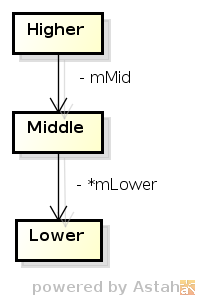

# オブジェクト指向設計の五大原則のお話

# アジェンダ

- 五大原則とは
- OCP
- SRP
- DIP
- ISP
- LSP

---

# 五大原則とは

## 以下の五つ:

- **S**RP：単一責務の原則
- **O**CP：開放-閉鎖の原則
- **L**SP：リスコフの置換則
- **I**SP：インターフェース分離の原則
- **D**IP：依存関係逆転の原則

## 何の原則？
オブジェクト指向でソフトウェアを作る際の、設計原則です。1990年代にRobert C. Martin (Uncle Bob)らが提唱しました。

## 覚えにくい
頭文字を並べると「SOLID」になって覚えやすいです。

でも、より重要な順番に説明します。

---

# OCP - 開放-閉鎖の原則

Open-Close Principle ： 開放-閉鎖の原則

## 定義

> SOFTWARE ENTITIES (CLASSES, MODULES, FUNCTIONS, ETC.)
SHOULD BE OPEN FOR EXTENSION, BUT CLOSED FOR
MODIFICATION.

> クラス、モジュール、関数といったソフトウェアの構成要素は、拡張に対して「開いて」おり、かつ変更に対して「閉じて」いなければならない。

---

# 開いて、閉じて・・・

---

## こういうこと

図形を描くプログラムを作っているとします。円形や矩形を描かねばなりません。
まずは、まずいやり方から。

    !c++
	class Shape
	{
		int shapeType;
	};
    class Circle : public Shape
	{
		Coord center;  // 中心座標
		double radius; // 半径
	};
	class Rectangle : public Shape
	{
		Coord topleft; // 左上座標
		Size size;     // 幅と高さ
	};

---
## (承前)

    !c++
    // 以下２関数はどこか別のところでいい感じに実装されているとする。
    void DrawCircle(Circle c);
    void DrawRectangle(Rectangle r);
    
    void DrawAllShapes()
    {
        ...
        
        for (i = 0; i < NUMBER_OF_SHAPETYPE; i++)
        {
            // 何らかの形で図形をShapeList[]の形で扱えるようにしたとする
            switch (ShapeList[i].shapeType)
			{
			case SHAPETYPE_CIRCLE:	
				DrawCircle((Circle)ShapeList[i]);
				break;
			case SHAPETYPE_RECTANGLE:
				DrawRectangle((Rectangle)ShapeList[i]);
				break;
			}
		}
	}

---

# 何がまずい？

---

# いろいろありますが、

---

# 一番ダメージが大きいのはこれ・・・

---

# 図形が増えるごとに変更が必要

---

    !c++
	void DrawAllShapes()
	{
		...
		// 何らかの形で図形をShapeList[]の形で扱えるようにしたとする
		for (i = 0; i < NUMBER_OF_SHAPETYPE; i++)
		{
			switch (ShapeList[i].shapeType)
			{
			case SHAPETYPE_CIRCLE:	
				DrawCircle((Circle)ShapeList[i]);
				break;
			case SHAPETYPE_RECTANGLE:
				DrawRectangle((Rectangle)ShapeList[i]);
				break;
			}
		}
	}

図形を描くプログラムというお題なので、サポートする図形が増えるというのはかなり高確率で発生しそうな拡張と言えます。でも、関数`DrawAllShapes`は、三角形(`Triangle`)をサポートしたくなったら変更が必要になります。

`DrawAllShapes`は拡張による影響を受けやすく、これは__拡張に対して開いていない__  わけです。

---

# で、どうするか？

---

# こんな風にします。

---

# まず、`Shape`を抽象化します。

    !c++
    class Shape
    {
    public:
        virtual void DrawShape() = 0;
	};

.notes: コンストラクタ／デストラクタは省略しています

---
# `Shape`インターフェースを実装します。

    !c++
    class Shape
    {
    public:
        virtual void DrawShape() = 0;
	};

## `Circle`と`Rectangle`を`Shape`から派生します。
    !c++
	class Circle : public Shape
	{
    public:
		void DrawShape(); // Circleなりの描画 
	};

    class Rectangle : public Shape
	{
    public:
		void DrawShape(); // Rectangleなりの描画 
	};

---
# `DrawAllShapes`をこのように直します。

## 個々の実装クラスごとの描画関数でなくインターフェースを呼ぶようにします。
    !c++
	void DrawAllShapes()
	{
		...
		// 何らかの形で図形をShapeList[]の形で扱えるようにしたとする
		for (i = 0; i < NUMBER_OF_SHAPETYPE; i++)
		{
			ShapeList[i]->DrawShape();
		}
	}

---

# 何がよくなった？

---

# 何がよくなった？

    !c++
	void DrawAllShapes()
	{
		...
		// 何らかの形で図形をShapeList[]の形で扱えるようにしたとする
		for (i = 0; i < NUMBER_OF_SHAPETYPE; i++)
		{
			ShapeList[i]->DrawShape();
		}
	}

- 図形が増えるにしたがって長たらしくなりそうだった`switch..case`文が姿を消しました。
- もし今後新たな図形`Triangle`をサポートすることになっても、`DrawAllShapes`は無改造で済みます。

`DrawAllShapes`は拡張に際して変更が不要、つまり__ 拡張に対して開いている __  状態になりました。

---

# 留意点

- もちろんいかなる場所にも、いかなる状況でも100%適用可能、というものではありません。
- 肝心なのは見極めです：
    + 安定していて変更の必要性が低いのはどこか
    + 拡張を見込んでおくべき部分はどこか
- そのクラスの責務/そのクラスに対する要求に因る
    + 安定している＝抽象化対象、拡張の可能性があるところ＝派生

## そしてこの見極めと判断、これこそが「設計」です。

---

# SRP - 単一責務の原則

Single Responsibility Principle ： 単一責務の原則

## 定義

> THERE SHOULD NEVER BE MORE THAN ONE REASON FOR A
> CLASS TO CHANGE.

> あるクラスを変更しなければならないとしたら、
> その理由はただ一つであるべきである。

---

#  二つ以上の責務を負っているとしたら

あるクラスの責務は、そのクラスを含むソフトウェアに対する要求事項と結びついています。
ということは、要求事項の変化に対して変更を余儀なくされる確率が高くなるということです。

柔軟に変更を受け入れることは重要ですが、その都度あちこちに変更の影響が及ぶのは避けねばなりません。
そのような設計は柔軟というよりむしろ__脆い設計__と言えます。

## ところで責務って？

責務＝役割という意味が一般的ですが、どうもその軸で考えてゆくといつの間にか複数の責務が一つのクラスに吹き溜まりです傾向があると思います。

責務＝変更の理由、と捉えるとよいでしょう。

---

# よく見るモデムの例

最近はモデムという装置そのものを目にすることが少なくなったため、イメージしにくい人も多いでしょう。
モデムは（乱暴にいうと）加入者電話回線を使ってコンピュータ同士の通信を行うための終端装置です。

そのため、回線接続のためにダイヤル(Dial-Up)し、データを送受信(Send/Receive)し、そして切断(Hang-Up)します。

これをそのままクラス化すると以下のようになるでしょう。

    !c++
    class Modem {
    public:
        DialUp();
        Send();
        Recv();
        HangUp();
    }

.notes: もちろん、状況によってはこのような`Modem`クラスの方がよい場合もあります。

---

# 何がいけない？

---

# 何がいけない？

一見、モデムという装置がもつ機能をうまい具合にまとめたように見えます。

    !c++
    class Modem {
    public:
        DialUp();
        Send();
        Recv();
        HangUp();
    };

先ほどの「責務」の定義に照らしてみると、二つの性質の異なる変更理由があります。

- 回線接続方法の変更
    - `DialUp()`と`HangUp()`
- データ通信方法の変更
    - `Send()`と`Recv()`

つまり、`Modem`クラスは回線接続とデータ通信という__二つの責務を負っている__と言えます。

---

# どうすべき？

---

# どうすべき？

二つの責務をそれぞれのクラスに分離します。

    !c++
    class LineConnection {
    public:
        DialUp();
        HangUp();
    };
    class DataChannel {
    public:
        Send();
        Recv();
    };

`LineConnection`クラスは回線接続機能に注力し、`DataChannel`クラスはデータ通信機能に注力しているので、それぞれの変更理由は一つずつになります。

---

# C++限定

前ページの解決例は、モデムを使った通信プログラムを書く側にとってはやや使い辛いと言えます。
    （設計原則を踏襲していて「綺麗」であったとしても使い勝手も重要ですので）

C++は多重継承を許しているため、両者をインターフェース化した上で継承することでまとめ直すことができます。

    !c++
    class LineConnection {
    public:
        virtual DialUp() = 0;
        virtual HangUp() = 0;
    };
    class DataChannel {
    public:
        virtual Send() = 0;
        virtual Recv() = 0;
    };
    class ModemImpl : public LineConnection, public Datachannel {
        ...
    };

Javaでは多重継承を使うことはできませんが、extendsとimplementsを適切に使えば同様のことは実現できるものと思います。

---

# 柔軟さと頑健さ

OCPで、拡張に「開いておくべき」と主張しておきながら、変更の確率を下げたいというのは何だか矛盾して聞こえるかもしれません。

しかし、基本的には一度作ってテストしたコードは変えたくないのです。オブジェクト指向だからと言ってこの考え方は変わりません。

C言語のような、非オブジェクト指向言語を用いる場合と何が違うのでしょうか。

それは、クラス分割と継承によって変更や拡張によって被る影響範囲を局所化しやすい点ではないでしょうか。

そうであれば、その特徴を活かすような使い方をしなければなりません。

柔軟さと脆さ、頑健と硬直の違い、といえるかもしれません。

---

# DIP - 依存関係逆転の原則

Dependency Inversion Principle ： 依存関係逆転の原則

## 定義
> A. HIGH LEVEL MODULES SHOULD NOT DEPEND UPON LOW
LEVEL MODULES. BOTH SHOULD DEPEND UPON ABSTRACTIONS.

> B. ABSTRACTIONS SHOULD NOT DEPEND UPON DETAILS. DETAILS
SHOULD DEPEND UPON ABSTRACTIONS.
>
> A. 上位のモジュールは、下位のモジュールに依存すべきでない。

> B. 「抽象」は「詳細」に依存すべきではない。「詳細」が「抽象」に依存すべきである。

---

# OCPなみの訳わからなさ

---

# なので例示します

## DIPに違反した状態

    !c++
    class Higher {
        ...
        Middle mMid;
    };
    class Middle {
        ...
        Lower* mLower;
    };
    class Lower {
        ...
    };

---

# クラス図

## DIPに違反した状態

---
# 何がいけない？

---

# 何がいけない？

## 特徴
- `Higher`クラスは`Middle`(実装を持つクラス)に依存している。
    - メンバー変数として具体的な実装を持つクラス。
- `Middle`クラスは`Lower`(実装を持つクラス)に…以下略
    - ポインタとはいえ実装を持つクラス＝具象クラスをメンバー変数として…以下略

## 問題点
- `Higher`は下位の`Middle`、`Lower`にも間接的に依存しているため、推移的に下位のクラスの変更の影響を受けやすくなります。
- 階層化による構造分割の眼目は階層間にインターフェースを設けることで、上位層が下位層の内部実装に依存せずに済むことですが、実装クラスに直接依存すると台無しになりやすくなります。

---
# どうすべき？

---

# どうすべき？

## 上位層は下位層の抽象物に依存すればよい

まずは下位層をそれぞれ抽象化します。
 
    !c++
    class IMiddle {
    public:
        virtual void MiddleFunction() = 0;
    };
    class ILower {
    public:
        virtual void LowerFunction() = 0;
    };

## それぞれ派生して実装クラスを作ります。

    !c++
    // IMiddleインターフェースを実装
    class Middle : public IMiddle {
    public:
        void MiddleFunction() { ... };
    private:
        ILower* mLower; // LowerではなくILowerに依存
    };
    // ILowerインターフェースを実装
    class Lower : public ILower {
    public:
        void LowerFunction() { ... };
    };

---
# どうすべき？（承前）

## Higherも直します

    !c++
    class Higher {
    public:
        ...
    private:
        IMiddle* mMiddle; // MiddleではなくIMiddleに依存
    };

実装クラスへの依存から抽象クラスへの依存へと切り替えました。
さらに、上位から下位方向への依存が、下位層が抽象層に依存するようになり、
__依存関係の方向性に逆転__が生じています。

---
# 補足

## 割愛しています
前出の`Higher`、`Middle`および`Lower`の例のままでは実はうまくゆきません。
各層間にある抽象クラスは実装を持たないため、実装クラスと結びつけてやる必要があります。

ただ、前出の例ではこれらのクラスがどのような文脈のなかで使われるか、というところを無視しているため、その結びつけを行う場所がありませんでした。
実際には次のように実装クラスと結びつけてから利用する必要があります。

    !c++
        ...
    Higher* h = new Higher();
    Middle* m = new Middle();
    Lower* l = new Lower();

    /*
       BindImplementation()は抽象クラス（のポインタ）の形で
       実装クラスのオブジェクトを受け取りメンバー変数にセット
       するような関数とする。
     */
    m->BindImplementation(l);
    h->BindImplementation(m);

    // Higherの利用
    h->DoSomething();

---

# クラス図

---
# 留意点

## 「結びつけ」は外部でおこなう

注意が必要なのは「結びつけ」をそれぞれ`Higher`、`Middle`の中でやってしまってはならないということです。
それぞれのインターフェースに対してどの実装クラスを使うか、ということは`Higher`を利用する文脈によって変わるでしょうし、
変えられなければ抽象化した意味がありません。

C++言語を用いる場合で、`main()`関数で`Higher`クラスを利用するようなケースであれば、上記の結びつけはmain()関数でやることになります。

---

# LSP - リスコフの置換則

Liskov's Substitution Principle ： リスコフの置換則

## 定義

> FUNCTIONS THAT USE POINTERS OR REFERENCES TO BASE
CLASSES MUST BE ABLE TO USE OBJECTS OF DERIVED CLASSES
WITHOUT KNOWING IT.

> 基底クラスへのポインタあるいは参照を利用する関数は、派生クラスのオブジェクトを、それと知ることなく利用できなければならない。

---

# どういうことか

## 前出の定義を言い換えると

派生クラスはその基本クラスと置換可能でなければらない、ということ。

## 実は結構深い

派生クラスのオブジェクトを基本クラスのポインタあるいは参照に渡せさえすればLSP準拠OK！ではありません。
実はLSPはその先の振る舞いについても同等性を求めています。

---

# 違反例

## 数学的には正しい

数学的？には正方形は矩形の一種と言えますので、次のような派生関係は自然な感じがします。

    !c++
    class Rectangle [
    public:
        set_width(int w);
        set_height(int h);
    };
    class Square : public Rectangle {
    public:
        set_witdh(int w);
        set_height(int h);
    };

## ここで`Square`の利用者の立場で考えてみると

正方形なのだから`set_width()`を呼び出しても`set_height()`を呼び出しても
一辺の長さは等しくなって頂きたいものです。

---

# そのように`Square`を改造

    !c++
    // どっちを呼んでも正方形！
    class Square : public Rectangle {
    public:
        set_witdh(int w) { m_width = w; m_height = w; };
        set_height(int h) { m_height = h; m_width = h; };
    };

よさげです。

---
# が、LSPには違反する

`Square`は`Rectangle`から派生していますので、`Rectangle`の参照を引数にとる関数に`Square`を渡しても問題ありません。
その関数内部で`Square`オブジェクトとして振る舞うこともできます。

しかし、次のような関数が存在しうる時点でLSPには違反しています。

    !c++
    void g(Rectangle& r)
    {
        r.set_width(5);
        r.set_height(4);
        
        // g()にSquareオブジェクトを渡すとこのassertは失敗する！
        assert(r.get_width()*r.get_height() == 20);
    }

---

# LSPに従うには？

実は、`Square`を`Rectangle`から派生する、という設計方針を変えるのがもっとも自然な解です。

## でも正方形は矩形の一種では？

単なる分類上ではその通りですが、我々が扱っているのはオブジェクトです。
オブジェクトは振る舞いを持っており、振る舞いの観点では`Square`と`Rectangle`は
異なる性質を持つのです。

    !c++
    class Rectangle [
    public:
        set_width(int w);
        set_height(int h);
    };
    class Square { // 派生を止めた
    public:
        set_side(int s);
    };

つまり両者は基底クラスと派生クラスの関係には__できない__、ということです。

---
# 違反しないためには？

## 派生先で振る舞いを変えない

先の例で言えば、`Square`の`set_width()`/`set_height()`がこれに抵触しています。
逆に言えば、派生先で振る舞いが変わるようなメソッドはpublicにしては
ならない、ということです。

## LSPの重要性

### OCPとDIPとの関係

実はこの原則が守られない状況では、OCPもDIPも守ることができません。
OCPとDIPの例をよく見ると、LSPが守られていることを前提としています。

いずれも抽象基底クラスを作りだし、そこから派生クラスを実装することで目的を達成していますが
その際、抽象基底クラスが提供するものはインターフェースであり、本来的には派生先で振る舞いを変えてよいものではありません。

## インターフェース

LSPが求めていることは、インターフェースの、振る舞い面での等価性の維持です。
あるクラス、モジュールにとって「インターフェース」はそのクラス・モジュールの
利用者側に対する約束、契約、規約のようなものです。

まずもってバシバシ仕様変更してよいものではないし、派生によって振る舞いや性質が
変わるのであれば、おそらくLSP違反です。

---
# ISP - インターフェース分離の原則

Interface Segregation Principle ： インターフェース分離の原則

## 定義

> CLIENTS SHOULD NOT BE FORCED TO DEPEND UPON INTERFACES
THAT THEY DO NOT USE.

> (インターフェースの)クライアントに対して、それが使用しないインターフェースへの依存を強制してはならない

---

SRPと同じく「混ぜるな危険」系の原則です。

---
# 最後に

オブジェクト指向設計は、基本的にオブジェクト指向言語を使うことを念頭に行うことが多いでしょう。
オブジェクト指向設計の原則は、今回紹介したもの以外にもまだいくつか古典的なものがあります。

当初はオブジェクト指向によって、コードの再利用性が高まると考える向きもあったようですが、
実態としては再利用性を高めようとすると、どうしても個別の事情を排除して「脱色」せざるを得ず、
単独では役に立たないほどの粒度になってしまうことが多いと思います。

そのため、コードそのものやモジュールそのものを再利用するより、「設計」を再利用する
という発想になっていったのではないかと思っています。

その「設計の再利用」のために考え出されたのが、建築の世界の「デザインパターン」の
考え方を取り入れた「ソフトウェアデザインパターン」だと思います。

---

私がこうした原則のありかを見つけるまでには、実に長い時間を要しました。
2000年頃、最初はC++を使っているけれどもC言語的にしか使えておらず、
自分のコードに違和感を感じてもやもやしていました。

クラスの書き方は分かるのですが、例えばオープンソースのコードなどを見ていても
「なぜそのようなクラス分けにしたのか」が分かりません。

オブジェクト指向において「よい設計」とはどんなものか、その指針となる考え方を
探し求めて悶々としていました。しかしその後、立場が変わってコードを書く機会が
ずっと減ってしまい、忙しさにかまけていつしか「探求」も止めてしまいました。

ところが、立場上だれかを指導することになったとき、結局「何がよい設計」という
命題を突きつけられることになり、改めて「探求」の旅を続けざるを得なくなったのです

---

本原稿の基本的なアイディアはRobert C. Martin（Uncle Bob Martin)氏が
書いた記事がベースとなっています。彼の設計原則に行き当たったのは思っても
見なかったルートからでした。

その頃からプロジェクトを率いることが多くなっていた私は、低額・超単納期の傾向は始まっており、
その傾向に鑑みてよりよいソフトウェア開発のやり方を模索していました。

そんなある日、ふとした偶然から、同僚の机の上に置いてあったExtreme Programmingという
過激そうなタイトルの本を手に取り、読んでみて激しい衝撃を受けました。
あまりに理想的で「本当にそんなことが可能なのか」と思えるほどでしたが、
同時に探し求めていたものを見つけた安堵感と興奮を覚えました。

よく見ると、その本は、日頃使っていたUMLツールJUDEの開発元である
チェンジビジョンの平鍋さんが監訳を手がけられたものでした。

そこから平鍋さんのブログを読むようになり、そこから平鍋さんが主催されていた
「オブジェクト倶楽部（現オブラブ）」に到達しました。宝の山のようでした。

そこまで到達したら、あとはUncle Bobの記事までは簡単にたどり着けました。
遅まきながら、長年求めていた「指針」を見つけたのです。あとは重要と思われる
5原則の記事を自分の手で和訳し、その作業を通じて学ぼうとしました。

---

設計原則にしてもデザインパターンにしても、できればそれと理解して実践して
身につけたいと思っています。

しかも、学ぶべきトピックスは他にも数多くあります。
道のりは長く一人では心が折れそうになります。
できれば同じような志の仲間と継続的に学び、
実践に活かしたいと思っています。

誰かやりませんか？

---

# 参考

## 原典

- ObjectMentor社
    - Robert C. Martin (通称：Uncle Bob Martin）他による記事
    - http://www.objectmentor.com/resources/publishedArticles.html
- オブジェクト倶楽部
    - 日本でのオブジェクト指向言語・設計手法黎明期のわかりやすい記事多数
    - http://www.objectclub.jp/

